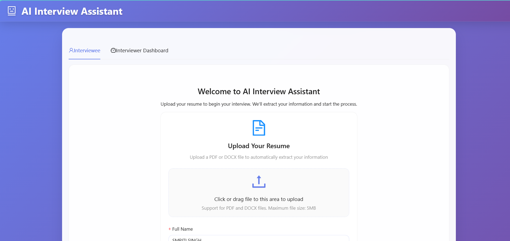
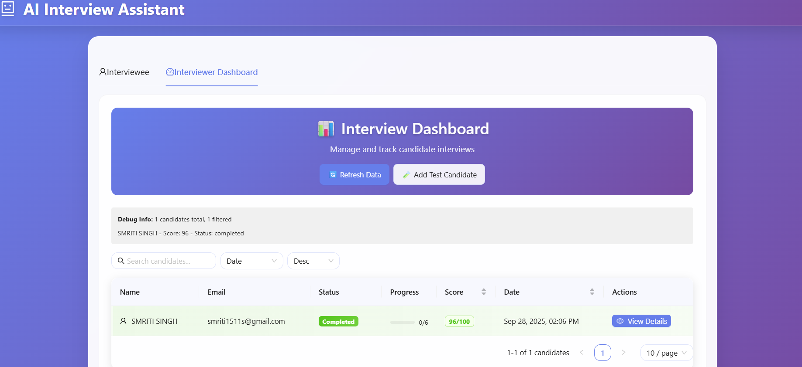

# 🚀 AI Interview Assistant

Welcome to **AI Interview Assistant** – a smart, intuitive platform designed to revolutionize your interview experience! Whether you're a candidate or an interviewer, our app streamlines the interview process with AI-powered insights, beautiful dashboards, and seamless resume management.

---

## ✨ Key Features

### 👤 For Interviewees
- **Resume Upload:** Instantly upload your PDF/DOCX resume and let our AI extract your details.
- **Smart Data Extraction:** Auto-fills your name, email, and phone for a smooth start.
- **Timed AI Interview:** Face 6 adaptive questions (Easy, Medium, Hard) with real-time progress tracking.
- **Auto-Submit:** Never worry about timing out—your answers are auto-submitted!
- **Interactive Chat:** Chat with an AI interviewer in a modern, engaging interface.

### 🧑‍💼 For Interviewers
- **Candidate Management:** Effortlessly search, sort, and track candidate progress.
- **Detailed Profiles:** Access resumes, contact info, and interview history at a glance.
- **AI Evaluation:** Automated scoring and candidate summaries for quick decision-making.
- **Performance Analytics:** Visualize progress and score distributions with beautiful charts.

---

## 🖼️ Screenshots

### Interviewee Experience
<p align="center">
  
</p> 

### Interviewer Dashboard
<p align="center">
  
</p> 

---

## 🌐 Live Demo

👉 **[Click here to try the live app](https://ai-powered-interview-assistant-inte.vercel.app/)**

or use the badge below:  

[](https://ai-powered-interview-assistant-inte.vercel.app/)

---

## 🛠️ Tech Stack

- **Frontend:** React 18 + TypeScript  
- **State:** Redux Toolkit & redux-persist  
- **UI:** Ant Design  
- **File Processing:** pdf-parse (PDF) & mammoth (DOCX)  
- **Styling:** Responsive CSS  
- **Build Tool:** Create React App  

---

## 🚦 Getting Started

### Prerequisites
- Node.js 16+
- npm or yarn

### Installation

```bash
git clone https://github.com/Smriti1511s/AI-Powered-Interview-Assistant-interview-buddy-.git
cd AI-Powered-Interview-Assistant-interview-buddy-
npm install
npm start


